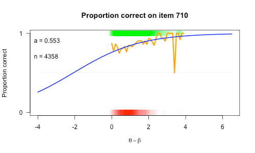
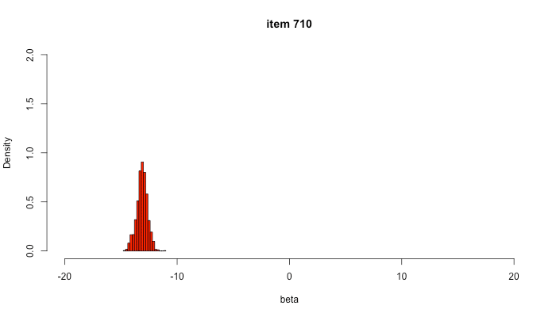
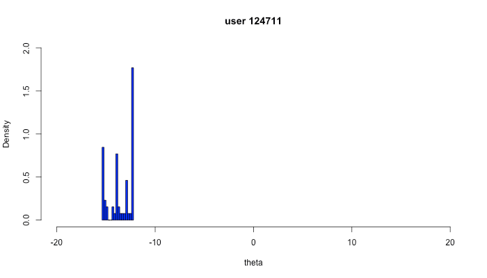
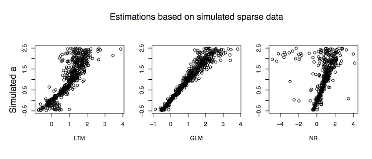

```{r setup, include=FALSE}
library(flexdashboard)
```

Inputs {.sidebar}
-----------------------------------------------------------------------

<h1>Research</h1>

The aim of this study is to find a feasable method to determine item discrimination values within the Math Garden to detect deviant items.

__What is the problem__

* Sparse data
* Scaling
* Identifiability

__Pragmatic solution__

So there are some fundamental problems in estimating a. But can we at least have some pragmatic solution?

<hr>

<!-- QR code box -->

<div style="text-align: center;">


https://goo.gl/a6ch6A
</div>

Column {data-width=500}
-----------------------------------------------------------------------

### Discrimination
    


   
### Item ratings
    

   
### User Ratings



Column
-----------------------------------------------------------------------

### Method

__Simulations__

Simulate responses and response times based on known $\theta$'s, $\beta$'s and $a$-parameters. Look how wel we can recover the $a$-parameter.

<div style="
    -webkit-column-count: 2;
       -moz-column-count: 2;
            column-count: 2;
            // border: 1px solid green;">

* Simulate full data
    * Estimate with LTM
    * GLM
    * Newton-Rapson
    
* Simulate sparse data
    * LTM
    * GLM
    * Newton-Rapson
</div>
Look at BIAS and SEM. 

### Proliminary Results



### To-DO {data-height=200}

<div style="
    -webkit-column-count: 2;
       -moz-column-count: 2;
            column-count: 2;
            // border: 1px solid green;">

* $a = 1$
* $a \sim U(0,3)$
* $a \sim U(-.5,3)$
* Apply NR in Math Garden
* Inactivate bad items
* Apply to real data

</div>